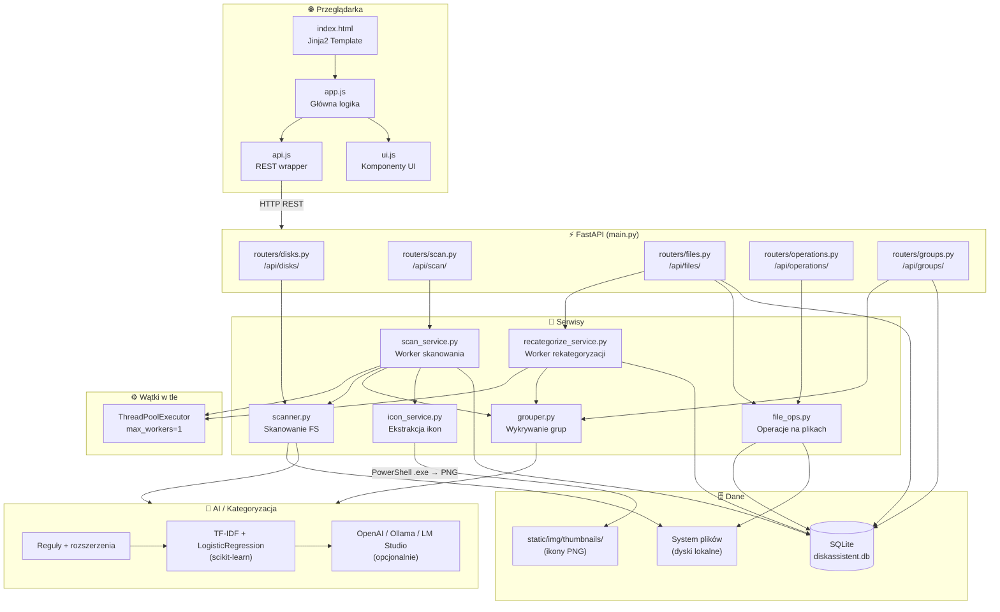

# DiskAssistent

A full-stack file management web application built with **FastAPI**, **SQLite**, and **Vanilla JS**.
Supports Windows and Linux with AI-powered file categorization, background disk scanning, folder grouping, and drag-and-drop file operations.

---

## Features

- **Disk overview** — lists all available drives/mount points with free/used space
- **Background scanning** — recursive filesystem scan runs as a background job with live progress polling
- **AI categorization** — files are automatically categorized into Games, Movies, Documents, Music, Images, Software, or Other using a three-tier strategy:
  1. Rule-based heuristics (extension + path keywords)
  2. scikit-learn TF-IDF + Logistic Regression classifier (local, no API key required)
  3. OpenAI API fallback (optional, requires `OPENAI_API_KEY`)
- **File operations** — move, rename, and delete files with safety checks
- **Folder groups** — related folders are automatically detected and grouped
- **Scan history** — keeps a log of all past scan jobs
- **Cross-platform** — works on Windows and Linux

---

## Requirements

- Python 3.10+
- Dependencies listed in `requirements.txt`

---

## Installation

```bash
git clone https://github.com/your-username/DiskAssistent.git
cd DiskAssistent
pip install -r requirements.txt
```

---

## Running the App

```bash
python run.py
```

Then open your browser at [http://localhost:8000](http://localhost:8000).

Alternatively, run directly with uvicorn:

```bash
uvicorn main:app --host 0.0.0.0 --port 8000 --reload
```

The SQLite database (`database/diskassistent.db`) is created automatically on first run.

---

## Configuration

Environment variables (all optional):

| Variable | Default | Description |
|---|---|---|
| `APP_HOST` | `0.0.0.0` | Host address to bind |
| `APP_PORT` | `8000` | Port to listen on |
| `OPENAI_API_KEY` | _(unset)_ | Enables OpenAI-based categorization fallback |

---

## API Overview

| Method | Endpoint | Description |
|---|---|---|
| `GET` | `/api/disks/` | List available disks with usage info |
| `GET` | `/api/disks/tree` | Recursive directory tree for a given path |
| `POST` | `/api/scan/start` | Start a background scan job |
| `POST` | `/api/scan/rescan-all` | Wipe DB and rescan all disks |
| `GET` | `/api/scan/status/{job_id}` | Poll scan progress |
| `GET` | `/api/scan/active` | Get currently running scan job |
| `GET` | `/api/scan/history` | 50 most recent scan jobs |
| `GET` | `/api/files/` | Query/filter scanned files |
| `PATCH` | `/api/files/` | Update file metadata |
| `POST` | `/api/operations/move` | Move a file |
| `POST` | `/api/operations/rename` | Rename a file |
| `POST` | `/api/operations/delete` | Delete a file |
| `GET` | `/api/groups/` | List detected folder groups |
| `PATCH` | `/api/groups/` | Update group metadata |

Full interactive API docs available at [http://localhost:8000/docs](http://localhost:8000/docs).

---

## 🏗️ Architektura aplikacji



---

## Project Structure

```
DiskAssistent/
├── main.py                  ← FastAPI application entry point
├── run.py                   ← Convenience launcher
├── requirements.txt
│
├── backend/
│   ├── config.py            ← App settings, OS detection, logging
│   ├── routers/
│   │   ├── disks.py         ← GET /api/disks/
│   │   ├── scan.py          ← POST /api/scan/start, GET /api/scan/status/{id}
│   │   ├── files.py         ← GET/PATCH /api/files/
│   │   ├── operations.py    ← POST /api/operations/{move,rename,delete}
│   │   └── groups.py        ← GET/PATCH /api/groups/
│   └── services/
│       ├── scanner.py       ← Recursive filesystem scanning
│       ├── file_ops.py      ← Move / rename / delete with safety checks
│       ├── grouper.py       ← Folder group detection
│       └── scan_service.py  ← Background scan worker
│
├── database/
│   ├── models.py            ← SQLAlchemy models (FileRecord, FileGroup, ScanJob)
│   └── diskassistent.db     ← Auto-created on first run
│
├── ai/
│   └── categorizer.py       ← Rule-based + ML + optional OpenAI categorization
│
├── frontend/
│   ├── templates/
│   │   └── index.html       ← Jinja2 template served at /
│   └── static/
│       ├── css/style.css
│       └── js/
│           ├── api.js       ← REST API wrapper
│           ├── ui.js        ← UI helpers (toast, modals, charts)
│           └── app.js       ← Main application logic
│
└── logs/
    └── app.log
```

---

## License

MIT

---

## ⚡ Quick Start

### 1. Prerequisites

- Python 3.10 or newer
- pip

### 2. Install dependencies

```bash
cd DiskAssistent
pip install -r requirements.txt
```

### 3. Run

```bash
python run.py
```

Or directly with uvicorn:

```bash
uvicorn main:app --reload --host 0.0.0.0 --port 8000
```

### 4. Open in browser

```
http://localhost:8000
```

---

## 🔧 Environment Variables

| Variable         | Default     | Description                           |
|------------------|-------------|---------------------------------------|
| `APP_HOST`       | `0.0.0.0`   | Bind host                             |
| `APP_PORT`       | `8000`      | Bind port                             |
| `OPENAI_API_KEY` | _(empty)_   | Optional — enables OpenAI fallback    |

---

## 🖥️ Cross-Platform Notes

- On **Windows**: disk list is built from Windows drive letters (A–Z).
- On **Linux/macOS**: disk list uses `psutil.disk_partitions()` (requires `psutil`).
- File paths use `pathlib.Path` throughout, so separators are handled automatically.

---

## 🤖 AI Categorization

Files are categorized using a 3-tier system:

1. **Rule-based heuristics** — extension + keyword matching (always runs, no deps).
2. **scikit-learn classifier** — TF-IDF + Logistic Regression trained on synthetic data (runs locally).
3. **OpenAI fallback** — only when `OPENAI_API_KEY` is set.

Users can manually override any category from the file detail modal.

---

## 📡 API Reference

| Method   | Endpoint                         | Description                  |
|----------|----------------------------------|------------------------------|
| GET      | `/api/disks/`                    | List disks with usage info   |
| GET      | `/api/disks/tree?path=…`         | Folder tree                  |
| POST     | `/api/scan/start`                | Start background scan job    |
| GET      | `/api/scan/status/{id}`          | Poll scan progress           |
| GET      | `/api/files/`                    | List/search/filter files     |
| GET      | `/api/files/stats`               | Aggregate statistics         |
| GET      | `/api/files/{id}`                | Single file detail           |
| PATCH    | `/api/files/{id}`                | Update category/tags/desc    |
| POST     | `/api/operations/move`           | Move a file                  |
| POST     | `/api/operations/rename`         | Rename a file                |
| DELETE   | `/api/operations/delete`         | Delete a file (confirm=true) |
| GET      | `/api/groups/`                   | List detected groups         |
| GET      | `/api/groups/{id}`               | Group detail with files      |
| PATCH    | `/api/groups/{id}`               | Update group metadata        |

Interactive API docs available at: `http://localhost:8000/docs`

---

## 🔒 Security Notes

- File operations require explicit confirmation from the client.
- Delete endpoint requires `confirm: true` in the request body.
- File names are sanitised before rename operations.
- System directories (Windows, System32, /proc, /sys, etc.) are skipped during scanning.

---

## 📦 Optional Enhancements

To enable duplicate file detection, image thumbnails, or user authentication, see the issues/roadmap in the repository.

---

## 🔮 Przyszłościowy wygląd aplikacji

DiskAssistent jest rozwijany jako pełnoprawne centrum zarządzania plikami w sieci domowej i małym biurze. Poniżej plan dalszego rozwoju:

### Interfejs użytkownika
- **Ciemny / jasny motyw** z zapisem preferencji w przeglądarce
- **Panel statystyk na żywo** — wykresy kołowe zajętości kategorii, histogramy rozmiarów plików i oś czasu skanowań
- **Widok mapy drzewa (Treemap)** — wizualizacja dysku jako kwadratów proporcjonalnych do rozmiaru grup i folderów
- **Szybki podgląd plików** — wbudowany viewer dla obrazów, tekstów i PDF bezpośrednio w oknie przeglądarki
- **Globalny skrót wyszukiwania** (Ctrl+K / Cmd+K) z wyszukiwaniem pełnotekstowym po nazwie, tagach i opisie

### Inteligentna kategoryzacja
- **Model ML trenowany na własnych danych** użytkownika — im dłużej aplikacja działa, tym lepiej rozumie kolekcję
- **Tagi automatyczne** generowane na podstawie metadanych EXIF (zdjęcia), ID3 (muzyka) i nagłówków dokumentów
- **Wykrywanie duplikatów** — porównanie po rozmiarze i haszowaniu SHA-256 z możliwością usunięcia w jednym kliknięciu
- **Reguły niestandardowe** — użytkownik definiuje własne reguły kategoryzacji (np. „wszystko z folderu `Faktury/` → Documents")

### Operacje na plikach
- **Masowe przenoszenie i zmiana nazw** — możliwość zaznaczenia wielu plików i wykonania operacji na całej grupie
- **Historia operacji i cofanie** — każda operacja (przeniesienie, zmiana nazwy, usunięcie) jest logowana z możliwością cofnięcia
- **Harmonogram automatycznego skanowania** — cykliczne skany dysku w tle bez ingerencji użytkownika

### Bezpieczeństwo i wielodostęp
- **Logowanie użytkowników** z rolami (Admin, Read-only) i sesjami JWT
- **Dziennik aktywności** — kto, kiedy i co zrobił z którym plikiem
- **HTTPS out-of-the-box** — wbudowana obsługa certyfikatów Let's Encrypt lub własnych

---

## 💾 Backup — przenoszenie plików na NAS lub tworzenie kopii zapasowych

> Planowana funkcjonalność

DiskAssistent będzie umożliwiał tworzenie kopii zapasowych wybranych plików lub całych grup na sieciowe zasoby dyskowe (NAS) lub lokalny katalog docelowy.

### Jak to będzie działać

1. **Definiowanie miejsca docelowego** — użytkownik konfiguruje jeden lub więcej celów backupu:
   - ścieżka UNC do udziału sieciowego (np. `\\NAS\Backup\`)
   - lokalny folder na innym dysku (np. `D:\Backup\`)
   - przyszłościowo: integracja z chmurą (WebDAV, SFTP)

2. **Wybór zakresu** — backup można uruchomić dla:
   - pojedynczego pliku z poziomu modalu szczegółów
   - całej grupy (np. „zrób kopię gry `Minecraft`")
   - kategorii (np. „zarchiwizuj wszystkie Dokumenty")
   - plików ze znacznikiem `is_missing = false` (tylko te obecne na dysku)

3. **Tryby operacji**:
   - **Kopia** — plik pozostaje w oryginalnym miejscu, do celu trafia kopia
   - **Przeniesienie** — plik jest przenoszony do celu i oznaczany w bazie jako `moved_to_backup = true`
   - **Synchronizacja (mirror)** — porównanie po dacie i rozmiarze, kopiowane są tylko zmienione pliki

4. **Postęp i raport** — backup uruchamiany jest w tle (tak jak skanowanie), a jego postęp można śledzić w tym samym stylu co `rescan-all`, z podziałem na pliki skopiowane / pominięte / błędne

5. **Weryfikacja integralności** — opcjonalne porównanie SHA-256 oryginału i kopii po zakończeniu transferu

### Planowane API

| Method | Endpoint | Description |
|--------|----------|-------------|
| `GET` | `/api/backup/targets` | Lista skonfigurowanych celów backupu |
| `POST` | `/api/backup/targets` | Dodaj nowy cel (ścieżka UNC, folder, SFTP) |
| `POST` | `/api/backup/start` | Uruchom backup dla wybranego zakresu |
| `GET` | `/api/backup/status/{job_id}` | Śledź postęp zadania backupu |
| `GET` | `/api/backup/history` | Historia wykonanych kopii zapasowych |

### Wymagania środowiskowe

- Dostęp do udziału sieciowego musi być zamontowany w systemie operacyjnym lub podany jako ścieżka UNC dostępna z konta uruchamiającego serwer
- Dla SFTP planowana jest opcjonalna zależność: `paramiko`
