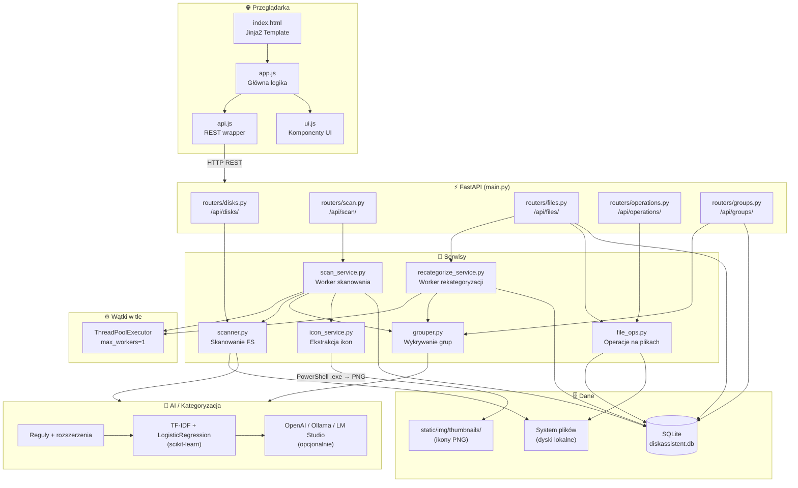

# DiskAssistent

A full-stack file management web application built with **Angular 18**, **FastAPI**, and **SQLite**.
Supports Windows and Linux with AI-powered file categorization, background disk scanning, folder grouping, and file operations.

> **Current branch:** `feature/microservices-architecture` — the application has been refactored from a monolith into four independent microservices.

---

## Features

- **Disk overview** — lists all available drives/mount points with free/used space
- **Background scanning** — recursive filesystem scan runs as a background job with live progress polling
- **AI categorization** — files are automatically categorized into Games, Movies, Documents, Music, Images, Software, or Other using a three-tier strategy:
  1. Rule-based heuristics (extension + path keywords)
  2. scikit-learn TF-IDF + Logistic Regression classifier (local, no API key required)
  3. OpenAI API fallback (optional, requires `OPENAI_API_KEY`)
- **File operations** — move, rename, and delete files with safety checks
- **Folder groups** — related folders are automatically detected and grouped
- **Archiving & deduplication** — archive groups and find duplicate files
- **Scan history** — keeps a log of all past scan jobs
- **Cross-platform** — works on Windows and Linux

---

## Architecture

```
┌─────────────────────────────────────────────────────────────────┐
│  Browser                                                        │
│  Angular 18 SPA  ──  http://localhost:4200                      │
│  (frontend/)                                                    │
└───────────────────────────────┬─────────────────────────────────┘
                                │ HTTP + proxy /api → :8001
                                ▼
┌─────────────────────────────────────────────────────────────────┐
│  WebAPI  ──  FastAPI  ──  http://localhost:8001                 │
│  (webapi/)                                                      │
│  • Handles: disks, files, groups, operations                    │
│  • Proxies heavy tasks → Worker Service                         │
└───────────────────────────────┬─────────────────────────────────┘
                                │ HTTP → :8002
                                ▼
┌─────────────────────────────────────────────────────────────────┐
│  Worker Service  ──  FastAPI  ──  http://localhost:8002         │
│  (worker-service/)                                              │
│  • Handles: scan, archive, dedup, recategorize                  │
│  • AI categorization (scikit-learn / OpenAI)                    │
└───────────────────────────────┬─────────────────────────────────┘
                                │ SQLAlchemy
                                ▼
┌─────────────────────────────────────────────────────────────────┐
│  Database Service  ──  Shared Python package                    │
│  (database-service/)                                            │
│  • Package: diskassistent-db                                    │
│  • SQLite: database/diskassistent.db                            │
│  • All SQLAlchemy models & init_db()                            │
└─────────────────────────────────────────────────────────────────┘
```

### Service Summary

| Service | Folder | Port | Role |
|---|---|---|---|
| **Frontend** | `frontend/` | 4200 | Angular 18 SPA — serves the user interface |
| **WebAPI** | `webapi/` | 8001 | REST API for UI — fast read/write operations |
| **Worker Service** | `worker-service/` | 8002 | Heavy background tasks (scan, archive, dedup, AI) |
| **Database Service** | `database-service/` | — | Shared Python package with all SQLAlchemy models |

---

## Requirements

### Python services (WebAPI + Worker)
- Python 3.10+
- Dependencies listed in each service's `requirements.txt`

### Frontend
- Node.js 18+ and npm
- Angular CLI 18 (`npm install -g @angular/cli`)

---

## Installation

```bash
git clone https://github.com/Nori93/DiskAssistent.git
cd DiskAssistent
```

**Install Python service dependencies:**

```bash
pip install -r webapi/requirements.txt
pip install -r worker-service/requirements.txt
```

**Install frontend dependencies:**

```bash
cd frontend
npm install
cd ..
```

---

## Running All Services

### Option A: VS Code — Compound launch

Open VS Code and run the **"DiskAssistent — All Services"** compound configuration (`.vscode/launch.json`).
It starts Worker Service → WebAPI → Frontend in order.

### Option B: Manual terminals

Open three separate terminals:

**Terminal 1 — Worker Service**
```bash
cd worker-service
uvicorn main:app --host 0.0.0.0 --port 8002 --reload
```

**Terminal 2 — WebAPI**
```bash
cd webapi
uvicorn main:app --host 0.0.0.0 --port 8001 --reload
```

**Terminal 3 — Frontend**
```bash
cd frontend
ng serve --proxy-config proxy.conf.json
```

Then open your browser at [http://localhost:4200](http://localhost:4200).

The SQLite database (`database/diskassistent.db`) is created automatically on first run by either Python service.

---

## Legacy Monolith

The original single-process version is still available on the `main` branch:

```bash
git checkout main
python run.py            # http://localhost:8000
```

The `.vscode/launch.json` file also contains a `[Legacy] Monolith` configuration for quick reference.

---

## Configuration

### Environment variables

| Variable | Service | Default | Description |
|---|---|---|---|
| `WEBAPI_PORT` | WebAPI | `8001` | Port for WebAPI |
| `WORKER_URL` | WebAPI | `http://localhost:8002` | Worker Service base URL |
| `WORKER_PORT` | Worker | `8002` | Port for Worker Service |
| `DISKASSISTENT_DB_PATH` | Both | `<repo>/database/diskassistent.db` | SQLite database path |
| `OPENAI_API_KEY` | Worker | _(unset)_ | Enables OpenAI categorization fallback |

---

## Project Structure

```
DiskAssistent/
│
├── database-service/           ← Shared Python package (diskassistent-db)
│   └── diskassistent_db/
│       ├── config.py           ← DB path + logger
│       └── models.py           ← All SQLAlchemy models & init_db()
│
├── webapi/                     ← FastAPI — port 8001
│   ├── main.py                 ← App entry point + proxy to Worker
│   ├── config.py               ← Port, WORKER_URL, logging
│   ├── requirements.txt
│   ├── routers/
│   │   ├── disks.py            ← GET /api/disks/
│   │   ├── files.py            ← GET/PATCH /api/files/
│   │   ├── groups.py           ← GET/PATCH /api/groups/
│   │   └── operations.py       ← POST /api/operations/{move,rename,delete}
│   └── services/
│       ├── scanner.py          ← Disk listing + directory tree
│       ├── file_ops.py         ← Move / rename / delete
│       └── settings_service.py ← Load / save settings.json
│
├── worker-service/             ← FastAPI — port 8002
│   ├── main.py                 ← App entry point + resume interrupted scans
│   ├── config.py               ← Port, logging
│   ├── requirements.txt
│   ├── routers/
│   │   ├── scan.py             ← POST /api/scan/start, GET /api/scan/status/{id}
│   │   ├── archive.py          ← POST /api/archive/{id}/archive, /restore
│   │   ├── dedup.py            ← POST /api/dedup/analyze, /apply
│   │   └── recategorize.py     ← POST /api/files/recategorize
│   ├── services/               ← Heavy processing workers
│   │   ├── scan_service.py
│   │   ├── archive_service.py
│   │   ├── dedup_service.py
│   │   ├── recategorize_service.py
│   │   ├── grouper.py
│   │   ├── scanner.py
│   │   └── settings_service.py
│   └── ai/
│       └── categorizer.py      ← Rule-based + ML + optional OpenAI
│
├── frontend/                   ← Angular 18 SPA — port 4200
│   ├── proxy.conf.json         ← /api → http://localhost:8001
│   ├── src/app/
│   │   ├── app.routes.ts
│   │   ├── app.config.ts
│   │   ├── services/
│   │   │   └── api.service.ts  ← Typed HTTP client for all endpoints
│   │   └── components/
│   │       ├── dashboard/
│   │       ├── disk-list/
│   │       ├── file-browser/
│   │       ├── groups/
│   │       ├── settings/
│   │       └── sidebar/
│   └── angular.json
│
├── database/
│   └── diskassistent.db        ← Auto-created SQLite database
│
├── logs/
│   ├── webapi.log
│   └── worker.log
│
├── settings.json               ← Archive/dedup directory settings
│
│   ── Legacy monolith (main branch) ──
├── main.py
├── run.py
├── requirements.txt
├── backend/
├── ai/
└── frontend/ (old Jinja2/vanilla JS)
```

---

## API Reference

All endpoints are served by the WebAPI on port 8001. Heavy operations are transparently proxied to the Worker Service on port 8002.

### Disks
| Method | Endpoint | Description |
|---|---|---|
| GET | `/api/disks/` | List disks with usage info |
| GET | `/api/disks/tree?path=…` | Folder tree |

### Scan (proxied to Worker)
| Method | Endpoint | Description |
|---|---|---|
| POST | `/api/scan/start` | Start background scan job |
| GET | `/api/scan/status/{id}` | Poll scan progress |
| GET | `/api/scan/active` | Currently running scan |
| GET | `/api/scan/history` | 50 most recent scan jobs |
| POST | `/api/scan/rescan-all` | Wipe DB and rescan all disks |

### Files
| Method | Endpoint | Description |
|---|---|---|
| GET | `/api/files/` | List/search/filter files |
| GET | `/api/files/stats` | Aggregate statistics |
| GET | `/api/files/{id}` | Single file detail |
| PATCH | `/api/files/{id}` | Update category/tags/desc |
| POST | `/api/files/recategorize` | Re-run AI categorization |
| POST | `/api/files/cleanup` | Remove missing file records |

### Groups
| Method | Endpoint | Description |
|---|---|---|
| GET | `/api/groups/` | List detected folder groups |
| GET | `/api/groups/{id}` | Group detail with files |
| PATCH | `/api/groups/{id}` | Update group metadata |
| DELETE | `/api/groups/{id}` | Delete a group |

### Operations
| Method | Endpoint | Description |
|---|---|---|
| POST | `/api/operations/move` | Move a file |
| POST | `/api/operations/rename` | Rename a file |
| DELETE | `/api/operations/delete` | Delete a file (confirm=true) |
| POST | `/api/operations/open-folder` | Open folder in OS explorer |

### Archive (proxied to Worker)
| Method | Endpoint | Description |
|---|---|---|
| GET | `/api/archive/settings` | Get archive/dedup settings |
| PUT | `/api/archive/settings` | Update settings |
| POST | `/api/archive/{id}/archive` | Archive a group |
| POST | `/api/archive/{id}/restore` | Restore an archived group |
| GET | `/api/archive/{id}/status` | Archive job status |

### Dedup (proxied to Worker)
| Method | Endpoint | Description |
|---|---|---|
| POST | `/api/dedup/analyze` | Find duplicate files |
| POST | `/api/dedup/apply` | Apply deduplication (hardlinks) |
| POST | `/api/dedup/restore` | Restore originals |
| GET | `/api/dedup/stats` | Dedup space savings |

Interactive API docs: `http://localhost:8001/docs` (WebAPI) · `http://localhost:8002/docs` (Worker)

---

## 🤖 AI Categorization

Files are categorized using a 3-tier system:

1. **Rule-based heuristics** — extension + keyword matching (always runs, no deps)
2. **scikit-learn classifier** — TF-IDF + Logistic Regression trained on synthetic data (runs locally)
3. **OpenAI fallback** — only when `OPENAI_API_KEY` is set

Users can manually override any category from the file detail view.

---

## 🖥️ Cross-Platform Notes

- On **Windows**: disk list is built from Windows drive letters (A–Z).
- On **Linux/macOS**: disk list uses `psutil.disk_partitions()`.
- File paths use `pathlib.Path` throughout, so separators are handled automatically.

---

## 🔒 Security Notes

- File operations require explicit confirmation from the client.
- Delete endpoint requires `confirm: true` in the request body.
- File names are sanitised before rename operations.
- System directories (Windows, System32, /proc, /sys, etc.) are skipped during scanning.

---

## License

MIT — see [LICENSE](LICENSE) for full text.

If you use DiskAssistent in a commercial product or organisation, we'd love to hear about it — drop us a message at **[norbert.wieczorek.93@gmail.com](mailto:norbert.wieczorek.93@gmail.com)**. It's not required, just appreciated.


---

## Features

- **Disk overview** — lists all available drives/mount points with free/used space
- **Background scanning** — recursive filesystem scan runs as a background job with live progress polling
- **AI categorization** — files are automatically categorized into Games, Movies, Documents, Music, Images, Software, or Other using a three-tier strategy:
  1. Rule-based heuristics (extension + path keywords)
  2. scikit-learn TF-IDF + Logistic Regression classifier (local, no API key required)
  3. OpenAI API fallback (optional, requires `OPENAI_API_KEY`)
- **File operations** — move, rename, and delete files with safety checks
- **Folder groups** — related folders are automatically detected and grouped
- **Scan history** — keeps a log of all past scan jobs
- **Cross-platform** — works on Windows and Linux

---

## Requirements

- Python 3.10+
- Dependencies listed in `requirements.txt`

---

## Installation

```bash
git clone https://github.com/your-username/DiskAssistent.git
cd DiskAssistent
pip install -r requirements.txt
```

---

## Running the App

```bash
python run.py
```

Then open your browser at [http://localhost:8000](http://localhost:8000).

Alternatively, run directly with uvicorn:

```bash
uvicorn main:app --host 0.0.0.0 --port 8000 --reload
```

The SQLite database (`database/diskassistent.db`) is created automatically on first run.

---

## Configuration

Environment variables (all optional):

| Variable | Default | Description |
|---|---|---|
| `APP_HOST` | `0.0.0.0` | Host address to bind |
| `APP_PORT` | `8000` | Port to listen on |
| `OPENAI_API_KEY` | _(unset)_ | Enables OpenAI-based categorization fallback |

---

## API Overview

| Method | Endpoint | Description |
|---|---|---|
| `GET` | `/api/disks/` | List available disks with usage info |
| `GET` | `/api/disks/tree` | Recursive directory tree for a given path |
| `POST` | `/api/scan/start` | Start a background scan job |
| `POST` | `/api/scan/rescan-all` | Wipe DB and rescan all disks |
| `GET` | `/api/scan/status/{job_id}` | Poll scan progress |
| `GET` | `/api/scan/active` | Get currently running scan job |
| `GET` | `/api/scan/history` | 50 most recent scan jobs |
| `GET` | `/api/files/` | Query/filter scanned files |
| `PATCH` | `/api/files/` | Update file metadata |
| `POST` | `/api/operations/move` | Move a file |
| `POST` | `/api/operations/rename` | Rename a file |
| `POST` | `/api/operations/delete` | Delete a file |
| `GET` | `/api/groups/` | List detected folder groups |
| `PATCH` | `/api/groups/` | Update group metadata |

Full interactive API docs available at [http://localhost:8000/docs](http://localhost:8000/docs).

---

## 🏗️ Architektura aplikacji



---

## Project Structure

```
DiskAssistent/
├── main.py                  ← FastAPI application entry point
├── run.py                   ← Convenience launcher
├── requirements.txt
│
├── backend/
│   ├── config.py            ← App settings, OS detection, logging
│   ├── routers/
│   │   ├── disks.py         ← GET /api/disks/
│   │   ├── scan.py          ← POST /api/scan/start, GET /api/scan/status/{id}
│   │   ├── files.py         ← GET/PATCH /api/files/
│   │   ├── operations.py    ← POST /api/operations/{move,rename,delete}
│   │   └── groups.py        ← GET/PATCH /api/groups/
│   └── services/
│       ├── scanner.py       ← Recursive filesystem scanning
│       ├── file_ops.py      ← Move / rename / delete with safety checks
│       ├── grouper.py       ← Folder group detection
│       └── scan_service.py  ← Background scan worker
│
├── database/
│   ├── models.py            ← SQLAlchemy models (FileRecord, FileGroup, ScanJob)
│   └── diskassistent.db     ← Auto-created on first run
│
├── ai/
│   └── categorizer.py       ← Rule-based + ML + optional OpenAI categorization
│
├── frontend/
│   ├── templates/
│   │   └── index.html       ← Jinja2 template served at /
│   └── static/
│       ├── css/style.css
│       └── js/
│           ├── api.js       ← REST API wrapper
│           ├── ui.js        ← UI helpers (toast, modals, charts)
│           └── app.js       ← Main application logic
│
└── logs/
    └── app.log
```

---

## License

MIT — see [LICENSE](LICENSE) for full text.

If you use DiskAssistent in a commercial product or organisation, we'd love to hear about it — drop us a message at **[norbert.wieczorek.93@gmail.com](mailto:norbert.wieczorek.93@gmail.com)**. It's not required, just appreciated.

---

## ⚡ Quick Start

### 1. Prerequisites

- Python 3.10 or newer
- pip

### 2. Install dependencies

```bash
cd DiskAssistent
pip install -r requirements.txt
```

### 3. Run

```bash
python run.py
```

Or directly with uvicorn:

```bash
uvicorn main:app --reload --host 0.0.0.0 --port 8000
```

### 4. Open in browser

```
http://localhost:8000
```

---

## 🔧 Environment Variables

| Variable         | Default     | Description                           |
|------------------|-------------|---------------------------------------|
| `APP_HOST`       | `0.0.0.0`   | Bind host                             |
| `APP_PORT`       | `8000`      | Bind port                             |
| `OPENAI_API_KEY` | _(empty)_   | Optional — enables OpenAI fallback    |

---

## 🖥️ Cross-Platform Notes

- On **Windows**: disk list is built from Windows drive letters (A–Z).
- On **Linux/macOS**: disk list uses `psutil.disk_partitions()` (requires `psutil`).
- File paths use `pathlib.Path` throughout, so separators are handled automatically.

---

## 🤖 AI Categorization

Files are categorized using a 3-tier system:

1. **Rule-based heuristics** — extension + keyword matching (always runs, no deps).
2. **scikit-learn classifier** — TF-IDF + Logistic Regression trained on synthetic data (runs locally).
3. **OpenAI fallback** — only when `OPENAI_API_KEY` is set.

Users can manually override any category from the file detail modal.

---

## 📡 API Reference

| Method   | Endpoint                         | Description                  |
|----------|----------------------------------|------------------------------|
| GET      | `/api/disks/`                    | List disks with usage info   |
| GET      | `/api/disks/tree?path=…`         | Folder tree                  |
| POST     | `/api/scan/start`                | Start background scan job    |
| GET      | `/api/scan/status/{id}`          | Poll scan progress           |
| GET      | `/api/files/`                    | List/search/filter files     |
| GET      | `/api/files/stats`               | Aggregate statistics         |
| GET      | `/api/files/{id}`                | Single file detail           |
| PATCH    | `/api/files/{id}`                | Update category/tags/desc    |
| POST     | `/api/operations/move`           | Move a file                  |
| POST     | `/api/operations/rename`         | Rename a file                |
| DELETE   | `/api/operations/delete`         | Delete a file (confirm=true) |
| GET      | `/api/groups/`                   | List detected groups         |
| GET      | `/api/groups/{id}`               | Group detail with files      |
| PATCH    | `/api/groups/{id}`               | Update group metadata        |

Interactive API docs available at: `http://localhost:8000/docs`

---

## 🔒 Security Notes

- File operations require explicit confirmation from the client.
- Delete endpoint requires `confirm: true` in the request body.
- File names are sanitised before rename operations.
- System directories (Windows, System32, /proc, /sys, etc.) are skipped during scanning.

---

## 📦 Optional Enhancements

To enable duplicate file detection, image thumbnails, or user authentication, see the issues/roadmap in the repository.

---

## 🔮 Przyszłościowy wygląd aplikacji

DiskAssistent jest rozwijany jako pełnoprawne centrum zarządzania plikami w sieci domowej i małym biurze. Poniżej plan dalszego rozwoju:

### Interfejs użytkownika
- **Ciemny / jasny motyw** z zapisem preferencji w przeglądarce
- **Panel statystyk na żywo** — wykresy kołowe zajętości kategorii, histogramy rozmiarów plików i oś czasu skanowań
- **Widok mapy drzewa (Treemap)** — wizualizacja dysku jako kwadratów proporcjonalnych do rozmiaru grup i folderów
- **Szybki podgląd plików** — wbudowany viewer dla obrazów, tekstów i PDF bezpośrednio w oknie przeglądarki
- **Globalny skrót wyszukiwania** (Ctrl+K / Cmd+K) z wyszukiwaniem pełnotekstowym po nazwie, tagach i opisie

### Inteligentna kategoryzacja
- **Model ML trenowany na własnych danych** użytkownika — im dłużej aplikacja działa, tym lepiej rozumie kolekcję
- **Tagi automatyczne** generowane na podstawie metadanych EXIF (zdjęcia), ID3 (muzyka) i nagłówków dokumentów
- **Wykrywanie duplikatów** — porównanie po rozmiarze i haszowaniu SHA-256 z możliwością usunięcia w jednym kliknięciu
- **Reguły niestandardowe** — użytkownik definiuje własne reguły kategoryzacji (np. „wszystko z folderu `Faktury/` → Documents")

### Operacje na plikach
- **Masowe przenoszenie i zmiana nazw** — możliwość zaznaczenia wielu plików i wykonania operacji na całej grupie
- **Historia operacji i cofanie** — każda operacja (przeniesienie, zmiana nazwy, usunięcie) jest logowana z możliwością cofnięcia
- **Harmonogram automatycznego skanowania** — cykliczne skany dysku w tle bez ingerencji użytkownika

### Bezpieczeństwo i wielodostęp
- **Logowanie użytkowników** z rolami (Admin, Read-only) i sesjami JWT
- **Dziennik aktywności** — kto, kiedy i co zrobił z którym plikiem
- **HTTPS out-of-the-box** — wbudowana obsługa certyfikatów Let's Encrypt lub własnych

---

## 💾 Backup — przenoszenie plików na NAS lub tworzenie kopii zapasowych

> Planowana funkcjonalność

DiskAssistent będzie umożliwiał tworzenie kopii zapasowych wybranych plików lub całych grup na sieciowe zasoby dyskowe (NAS) lub lokalny katalog docelowy.

### Jak to będzie działać

1. **Definiowanie miejsca docelowego** — użytkownik konfiguruje jeden lub więcej celów backupu:
   - ścieżka UNC do udziału sieciowego (np. `\\NAS\Backup\`)
   - lokalny folder na innym dysku (np. `D:\Backup\`)
   - przyszłościowo: integracja z chmurą (WebDAV, SFTP)

2. **Wybór zakresu** — backup można uruchomić dla:
   - pojedynczego pliku z poziomu modalu szczegółów
   - całej grupy (np. „zrób kopię gry `Minecraft`")
   - kategorii (np. „zarchiwizuj wszystkie Dokumenty")
   - plików ze znacznikiem `is_missing = false` (tylko te obecne na dysku)

3. **Tryby operacji**:
   - **Kopia** — plik pozostaje w oryginalnym miejscu, do celu trafia kopia
   - **Przeniesienie** — plik jest przenoszony do celu i oznaczany w bazie jako `moved_to_backup = true`
   - **Synchronizacja (mirror)** — porównanie po dacie i rozmiarze, kopiowane są tylko zmienione pliki

4. **Postęp i raport** — backup uruchamiany jest w tle (tak jak skanowanie), a jego postęp można śledzić w tym samym stylu co `rescan-all`, z podziałem na pliki skopiowane / pominięte / błędne

5. **Weryfikacja integralności** — opcjonalne porównanie SHA-256 oryginału i kopii po zakończeniu transferu

### Planowane API

| Method | Endpoint | Description |
|--------|----------|-------------|
| `GET` | `/api/backup/targets` | Lista skonfigurowanych celów backupu |
| `POST` | `/api/backup/targets` | Dodaj nowy cel (ścieżka UNC, folder, SFTP) |
| `POST` | `/api/backup/start` | Uruchom backup dla wybranego zakresu |
| `GET` | `/api/backup/status/{job_id}` | Śledź postęp zadania backupu |
| `GET` | `/api/backup/history` | Historia wykonanych kopii zapasowych |

### Wymagania środowiskowe

- Dostęp do udziału sieciowego musi być zamontowany w systemie operacyjnym lub podany jako ścieżka UNC dostępna z konta uruchamiającego serwer
- Dla SFTP planowana jest opcjonalna zależność: `paramiko`
